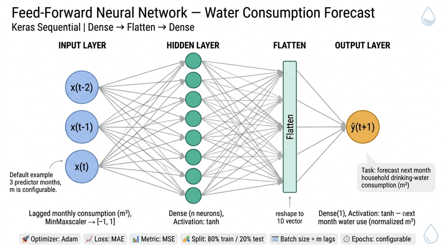

# Forecasting with neural networks

## Overview

Demo application that implements the training process of a neural network for forecasting monthly water consumption of a household.

## Stack

| Layer | Technology |
| --- | --- |
| Language | Python 3.9+ |
| Deep learning | Keras 2.4.3, TensorFlow 2.4.0 |
| Data | pandas, NumPy, scikit-learn |
| Visualization | matplotlib |
| Config | python-dotenv (`.env`) |

Dependencies are declared in `pyproject.toml`.

## Neural network architecture

Feed-forward multilayer perceptron (MLP) for monthly water-consumption forecasting:

- 1 hidden layer with `n` neurons (entered via console)
- 1 output neuron
- Activation: Hyperbolic Tangent (`tanh`), for values normalized to `[-1, 1]`
- Optimizer: Adam
- Loss: Mean Absolute Error (MAE)
- Metric: Mean Squared Error (MSE)



## Dataset

Monthly drinking-water consumption (m³) is loaded from
[`data/water_consumption.json`](data/water_consumption.json)
(override with `WC_DATA_FILE` in `.env`).

Structure (building → apartment → monthly records):

```json
{
  "DEMO": {
    "A101": [
      {
        "year": 2017,
        "month": 11,
        "billing_date": "2017-11-11",
        "m3": 27.957,
        "billed_amount": 42.63
      }
    ]
  }
}
```

Top-level keys are building codes; nested keys are apartment names. Each record field:

| Field | Meaning |
| --- | --- |
| `year` | Billing year |
| `month` | Billing month (1–12) |
| `billing_date` | Invoice / reading date (`YYYY-MM-DD`) |
| `m3` | Water consumption in cubic meters |
| `billed_amount` | Amount billed for that period |

Demo property: building `DEMO`, apartment `A101`.

## Requirements

Install runtime dependencies with:

```bash
pip install -e .
```

For development tools (ruff, mypy):

```bash
pip install -e ".[dev]"
```

Pinned runtime versions:

```bash
numpy 1.19.3
pandas 1.0.1
Keras 2.4.3
tensorflow 2.4.0
scikit-learn 0.22.1
matplotlib 3.1.3
python-dotenv
pytz
```

## Configuration

Copy the environment template and edit local values (dataset path, NN defaults):

```bash
cp .env.example .env
```

## How to run

```bash
python application.py train
```

When prompted, you can use building `DEMO` and apartment `A101`.
